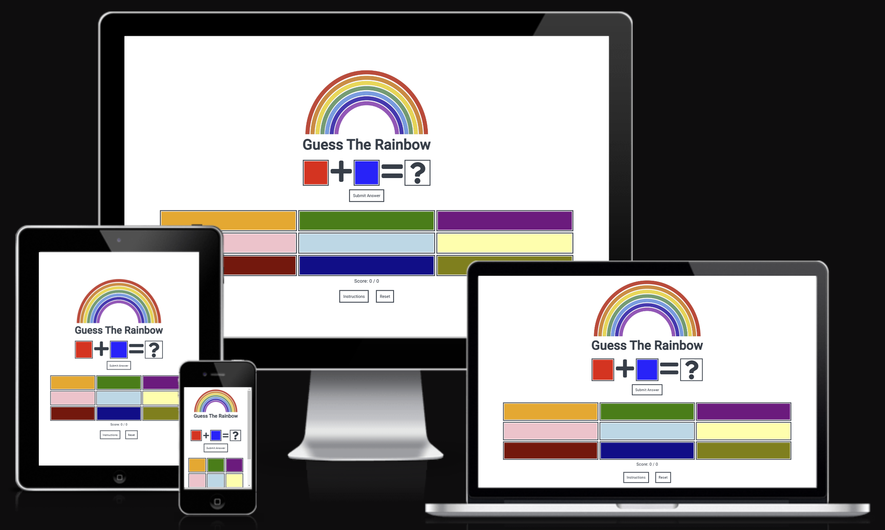

# Guess The Rainbow

Guess The Rainbow is an interactive website designed to test the users knowledge of basic colour mixing.
The website is designed to be a responsive website that can be accessed and easily viewed on a range of screen sizes.
The primary audience of the site will be children and anyone else interested in learning the basics of colour mixing.

[The deployed website can be found here](https://victoriaparkes.github.io/guess-the-rainbow/)

# Contents
/////////////////////////

---

# Features
## Current Features
The main content website is a displayed on a single page with the following features:
- A header with logo and title.
- A "welcome" modal is displayed on loading the page to welcome the user and inform them of the structure of the game.
- An interactive question section displaying the question to answer, with functionality to inform the user in text of the colours displayed when the cursor is hovered over the elements.
- A "Submit Answer" button used to submit the choosen answer to the question for feedback.
- A grid of colours to choose the answer from which will change the background colour of the question answer box to reflect the choosen answer. Each section of the colour grid also has the functionality to display the section colour in text when the cursor is hovered over.
- The user score is displayed below the colour grid displaying the number of correct answers out of the number of questions answered.

- Feedback is recieved via the display of a modal:
 - "Select an Answer" modal to inform the user they have not submitted an answer.
 - "Correct" modal to inform the user they have submitted the correct answer.
 - "Incorrect" modal to inform the user they have submitted an incorrect answer and inform them of the correct answer.
- An instrutions button which displays a modal containing instructions informing the user how to use the website.

- A reset button with the functionality to reset the game. The questions and score are reset when clicked.

The website also has a 404 error page informing the user that the page cannot be loaded.

## Future Features
- More advanced game play levels testing the user on the mixing of secondary and tertiary colours.

---

# Design

## Structure
The website is designed with a simple structure with the content positioned centrally on the page displayed vertically in the following order:

- The logo
- The game title
- The question
- The submit button
- The answer options displayed in a grid format
- The user's current score
- The instructions and reset buttons

## Wireframes
Click [here](docs/wireframes.png) to view the wireframes.

## Colour Scheme

The colour scheme was chosen to complement the colours in the images without causing distraction and provide contrast for good readability of the information. The colour palette was created using [Coolors](https://coolors.co/).

## Typography
[Google Fonts](https://fonts.google.com/) was used to add the following fonts:
- 'Roboto' was used for the font of the whole website to provide a simple and clean appearance.

## Imagery
The logo image was chosen to reflect the content and title of the game, and provide a simple appearance without causing distraction.

## Icons
Icons were used for the arithmetic symbols and the question mark displayed in the question.

All icons were sourced from [Font Awesome](https://fontawesome.com/).

---

