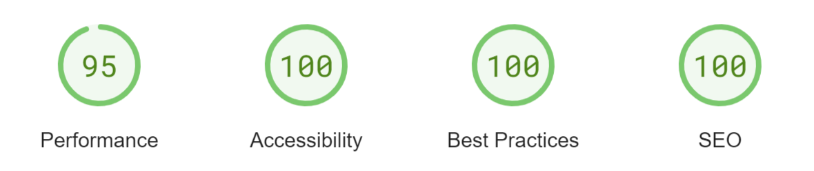

# Guess The Rainbow


Guess The Rainbow is an interactive website designed to test the users knowledge of basic colour mixing.
The website is designed to be a responsive website that can be accessed and easily viewed on a range of screen sizes.
The primary audience of the site will be children and anyone else interested in learning the basics of colour mixing.

[The deployed website can be found here](https://victoriaparkes.github.io/guess-the-rainbow/)

# Contents
1. [User Experience (UX)](#1-user-experience-ux)
    - [User Stories](#user-stories)
2. [Features](#2-features)
    - [Current Features](#current-features)
    - [Future Features](#future-features)
3. [Design](#3-design)
    - [Structure](#structure)
    - [Wireframes](#wireframes)
    - [Colour Scheme](#colour-scheme)
    - [Typography](#typography)
    - [Imagery](#imagery)
    - [Icons](#icons)
4. [Technologies Used](#4-technologies-used)
5. [Testing](#5-testing)
    - [Functionality Testing](#functionality-testing)
    - [Browser Compatibility](#browser-compatibility)
    - [W3C HTML Validator Testing](#w3c-html-validator-testing)
    - [W3C CSS Validator Testing](#w3c-css-validator-testing)
    - [JSHint Javascript Validator Testing](#jshint-javascript-validator-testing)
    - [Lighthouse Auditing](#lighthouse-auditing)
    - [Bugs Encountered](#bugs-encountered)
        - [Fixed](#fixed)
6. [Deployment and Local Development](#6-deployment-and-local-development)
    - [Deployment](#deployment)
    - [Local Development](#local-development)
        - [Forking the Repository](#forking-the-repository)
        - [Cloning Your Forked Repository](#cloning-your-forked-repository)
7. [Credits](#7-credits)
    - [Code](#code)
    - [Content](#content)
    - [Media](#media)
    - [Acknowledgements](#acknowledgements)

# 1. User Experience (UX)
## User Stories
As a user I would like:
- To improve my knowledge of colour mixing.
- Easily determine the purpose of the website.
- View the site on any device.

# 2. Features
## Current Features
The main content website is a displayed on a single page with the following features:
- A favicon in the browser tab.


- A header with logo and title.
- A "welcome" modal is displayed on loading the page to welcome the user and inform them of the structure of the game.
- An interactive question section displaying the question to answer, with functionality to inform the user in text of the colours displayed when the cursor is hovered over the elements.
- A "Submit Answer" button used to submit the choosen answer to the question for feedback.
- A grid of colours to choose the answer from which will change the background colour of the question answer box to reflect the choosen answer. Each section of the colour grid also has the functionality to display the section colour in text when the cursor is hovered over.
- The user score is displayed below the colour grid displaying the number of correct answers out of the number of questions answered.


- Feedback is recieved via the display of a modal:
 - "Select an Answer" modal to inform the user they have not submitted an answer.
 - "Correct" modal to inform the user they have submitted the correct answer.
 - "Incorrect" modal to inform the user they have submitted an incorrect answer and inform them of the correct answer.
- An instrutions button which displays a modal containing instructions informing the user how to use the website.


- A reset button with the functionality to reset the game. The questions and score are reset when clicked.

The website also has a 404 error page informing the user that the page cannot be loaded.

## Future Features
- More advanced game play levels testing the user on the mixing of secondary and tertiary colours.

# 3. Design

## Structure
The website is designed with a simple structure with the content positioned centrally on the page displayed vertically in the following order:

- The logo
- The game title
- The question
- The submit button
- The answer options displayed in a grid format
- The user's current score
- The instructions and reset buttons

## Wireframes
Click [here](docs/wireframes.png) to view the wireframes.

## Colour Scheme

The colour scheme was chosen to complement the colours in the images without causing distraction and provide contrast for good readability of the information. The colour palette was created using [Coolors](https://coolors.co/).

## Typography
[Google Fonts](https://fonts.google.com/) was used to add the following fonts:
- 'Roboto' was used for the font of the whole website to provide a simple and clean appearance.

## Imagery
The logo image was chosen to reflect the content and title of the game, and provide a simple appearance without causing distraction.

## Icons
Icons were used for the arithmetic symbols and the question mark displayed in the question.

All icons were sourced from [Font Awesome](https://fontawesome.com/).

# 4. Technologies Used
HTML - to create the structure of the website.

CSS - to add style to the website.

Javasript - to functionality to the website.

[Chrome DevTools](https://developer.chrome.com/docs/devtools/) - used to help test features and for debugging.

[Google Fonts](https://fonts.google.com/) - a fonts library.

[Font Awesome](https://fontawesome.com/) - for iconography used on the website.

[Git](https://git-scm.com/) - for version control.

[GitHub](https://github.com/) - to create and store the project repository.

[GitPod](https://gitpod.io/) - development hosting platform used to create the website.

[Balsamiq](https://balsamiq.com/) - used to create Wireframes for the layout of the pages.

[Coolors](https://coolors.co/) - used to create the colour palette.

[Rawpixel](https://www.rawpixel.com/) - used to source logo image.

[CloudConvert](https://cloudconvert.com/) - used to convert images to webp format.

[favicon.cc](https://www.favicon.cc/) - to to create the favicon.

[Am I Responsive](https://ui.dev/amiresponsive) - To view the website on a range of devices and create the mock-up screenshot image.

[Pericles](https://getpericles.com/) - Screen reader used to test accessiblity.

[The W3C Markup Validation Service](https://validator.w3.org/) - Used to validate HTML files.

[The W3C CSS Validation Service](https://jigsaw.w3.org/css-validator/) - Used to validate the CSS file.

[JSHint](https://jshint.com/) - Used to validate the javascript file.

[PageSpeed Insights](https://pagespeed.web.dev/) - Used to generate lighthouse report for 404 error page as lighthouse was unable to load the page when used in Chrome Developer Tools.

[Prettier.io](https://prettier.io/) - Used to format code.

# 5. Testing
[Chrome DevTools](https://developer.chrome.com/docs/devtools/) was frequently utilised in the development of the website to manipulate and test features as they were added to the project, to test responsiveness and for debugging purposes.

[Pericles](https://getpericles.com/) screen reader was used to test the screen reader only elements intended to improve the accessiblity of the website.

## Functionality Testing

[See Functionality Testing Document](docs/testing/functionality-testing.md)

## Browser Compatibility
The website was tested for functionality on different browsers (Chrome, Firefox and Edge) and found to be fully functional on them all.

## W3C HTML Validator Testing
The [W3C Markup Validation Service](https://validator.w3.org/) was used to validate the HTML files.


## W3C CSS Validator Testing
The [W3C CSS Validation Service](https://jigsaw.w3.org/css-validator/) was used to validate the CSS in the stylesheet.


## JSHint Javascript Validator Testing
[JSHint](https://jshint.com/) was used to validate the javascript code in the script file.


## Lighthouse Auditing
I frequently used Lighthouse in the Chrome Developer Tools to allow me to test the performance, accessibility, best practices and SEO of the website during the development of the website.

Lighthouse audit reports are as follows:
### Index - Mobile

### Index - Desktop

### 404 - Mobile

### 404 - Desktop


Diagnostics for all pages tested suggested to 'serve static assets with an efficient cache policy'. HTTP caching can be used to speed up the page load time on repeat visits by storing such as images, css files and javascript files. Web caches are used to reduce latency because the resources are stored closer to the client instead of the origin server speeding up the time it takes to satisfy requests for the resources and display the information on the website. Caching resources also reduces network traffic as the cached files are available locally to the client so they do not need to be downloaded again. The resources cached for this website are stored for 10 minutes before the cache expires and the files must be requested from the origin server again. Increasing the cache duration could speed up repeat visits to the website.


## Bugs Encountered
### Fixed
1. Keydown event listener was not fuctioning. The problem was fixed by targeting the whole document instead of the answer box.
2. When viewed on mobile devices the hover text was displayed before the span innerHTML was changed resulting in the previously displayed hover text being displayed. This problem was fixed by giving each span a unique id attribute and using these to set the innerHTML of each span in javascript.
3. When the submit and instructions buttons were clicked, focus remained on the button. Hitting enter to close displayed modal called the button function again. This problem was fixed by adding ```.blur();``` to display modal functions to remove focus from the button.

# 6. Deployment and Local Development
## Deployment
The site was deployed to GitHub pages. 

The steps to deploy are as follows:
1. Log in (or sign up) to GitHub.
2. Go to the repository for this project (https://github.com/VictoriaParkes/guess-the-rainbow).
3. In the GitHub repository, navigate to the 'Settings' tab.
4. From the 'Code and automation' section of the menu on the left, select 'Pages'.
5. In the 'Build and deployment' section, under the heading 'Source' select 'Deploy from a branch' from the dropdown menu.
6. Under the heading 'Branch', select 'main' from the branch selection dropdown menu and '/root' from the 'Select folder' dropdown menu.
7. Click save, the page will be automatically refreshed and a message reading 'GitHub Pages source saved.' will be displayed to confirm successful deployment.
8. The link to the live site will be displayed at the top of the 'GitHub Pages' page once deployment has completed and can be used to access the live website.

The live link can be found here - [Guess The Rainbow](https://victoriaparkes.github.io/guess-the-rainbow/)

## Local Development
### Forking the Repository
The steps to fork the repository are as follows:
1. Log in to GitHub.
2. Go to the repository for this project (https://github.com/VictoriaParkes/guess-the-rainbow).
3. In the top-right corner of the page, click 'Fork'.
4. Under 'Owner', select an owner for the repository from the dropdown menu.
5. Optionally, in the "Description" field, type a description of your fork.
6. To copy the main branch only, select the 'Copy the main branch only' check box. If you do not select this option, all branches will be copied into the new fork.
7. Click 'Create fork'

### Cloning Your Forked Repository
1. Log-in to GitHub.com, navigate to your fork of the repository.
2. Above the list of files, click Code.
3. Copy the URL for the repository.
    - To clone the repository using HTTPS, under "Clone with HTTPS", click the 'Copy' icon.
    - To clone the repository using an SSH key, including a certificate issued by your organization's SSH certificate authority, click SSH, then click the 'Copy' icon.
    - To clone a repository using GitHub CLI, click Use GitHub CLI, then click the 'Copy' icon.
4. Open Git Bash
5. Change the current working directory to the location where you want the cloned directory.
6. Type git clone, and then paste the URL you copied earlier.
7. Press Enter. Your local clone will be created.

For more details about forking and cloning a repository, please refer to [GitHub documentation](https://docs.github.com/en/get-started/quickstart/fork-a-repo).

# 7. Credits
## Code
[W3 Schools](https://www.w3schools.com/) and lessons from [Code Institute's Full Stack Developer Course](https://codeinstitute.net/full-stack-software-development-diploma/) were frequently referred to in the development of this website.

- The favicon was implemnted using code from Code Institute's "Love Maths" project.
- The modals were created using W3school's [How TO - CSS/JS Modal](https://www.w3schools.com/howto/howto_css_modals.asp).
- The colour selection functionality was created using [Change Background Color onclick using JavaScript
](https://www.howtocodeschool.com/2021/01/change-background-color-onclick-using-javascript.html#html-code) from How to Code School.
- I learned to use the ```getcomputedstyle();``` method using W3school's page [Window getComputedStyle()](https://www.w3schools.com/JSREF/jsref_getcomputedstyle.asp).
- The hover text was created using W3school's page [How TO - Display an Element on Hover](https://www.w3schools.com/css/css_tooltip.asp).
- I learned to position elements centrally on the page using W3school's page [CSS Layout - Horizontal & Vertical Align](https://www.w3schools.com/css/css_align.asp).
- [Font Awesome docs](https://fontawesome.com/v5/docs/web/other-topics/accessibility) were refered to in order to make the website more accessible to a wider audience.

## Content
The content of the website was written by Victoria Parkes.

The local development section of this document was written using [GitHub documentation](https://docs.github.com/en/get-started/quickstart/fork-a-repo).

## Media
The website logo image was sourced from [Rawpixel](https://www.rawpixel.com/image/6587780/png-sticker-icon)

## Acknowledgements
I would like to thank Brian Macharia, my Code Institute mentor, for his helpful feedback and advice.